# Hướng dẫn thực hành GitOps với vProfile

Tài liệu này hướng dẫn từng bước để thực hành triển khai ứng dụng **vProfile** (multi-tier) lên
Kubernetes (AWS EKS) theo mô hình **GitOps**, kèm pipeline CI/CD bằng GitHub Actions. Người đọc
có thể follow theo để tự thực hành lại.

> Tài liệu chia thành các Phần A→K (44 bước). Có thể đọc tuần tự từ đầu để dựng toàn bộ hệ thống.

---

## Mục lục

- [1. Tổng quan kiến trúc](#1-tổng-quan-kiến-trúc)
- [2. Yêu cầu chuẩn bị (Prerequisites)](#2-yêu-cầu-chuẩn-bị-prerequisites)
- [PHẦN A — Khởi tạo repo và Helm chart](#phần-a--khởi-tạo-repo-và-helm-chart) · *Bước 1–3*
- [PHẦN B — CI: Phân tích chất lượng code với SonarQube](#phần-b--ci-phân-tích-chất-lượng-code-với-sonarqube) · *Bước 4–7*
- [PHẦN C — Registry, quyền truy cập và thông báo (ECR, IAM, Slack)](#phần-c--registry-quyền-truy-cập-và-thông-báo-ecr-iam-slack) · *Bước 8–10*
- [PHẦN D — GitHub PAT và lưu Secrets/Variables](#phần-d--github-pat-và-lưu-secretsvariables) · *Bước 11–13*
- [PHẦN E — Pipeline CI/CD với GitHub Actions](#phần-e--pipeline-cicd-với-github-actions) · *Bước 14–16*
- [PHẦN F — Chạy pipeline qua Pull Request](#phần-f--chạy-pipeline-qua-pull-request) · *Bước 17–22*
- [PHẦN G — Chuẩn bị cho EKS + ArgoCD (Terraform prerequisites)](#phần-g--chuẩn-bị-cho-eks--argocd-terraform-prerequisites) · *Bước 23–27*
- [PHẦN H — Dựng EKS cluster bằng Terraform](#phần-h--dựng-eks-cluster-bằng-terraform) · *Bước 28–31*
- [PHẦN I — Cài AWS Load Balancer Controller và ArgoCD](#phần-i--cài-aws-load-balancer-controller-và-argocd) · *Bước 32–36*
- [PHẦN J — Cấu hình ArgoCD đồng bộ vProfile (GitOps CD)](#phần-j--cấu-hình-argocd-đồng-bộ-vprofile-gitops-cd) · *Bước 37–41*
- [PHẦN K — Truy cập vProfile và kiểm thử luồng GitOps end-to-end](#phần-k--truy-cập-vprofile-và-kiểm-thử-luồng-gitops-end-to-end) · *Bước 42–44*
- [Tổng kết](#tổng-kết)

---

## 1. Tổng quan kiến trúc

vProfile là ứng dụng web Java gồm nhiều thành phần (tier):

| Thành phần | Vai trò | Image | Port |
|------------|---------|-------|------|
| `vproapp`     | App server (Tomcat chạy file `vprofile-v2.war`) | `vprocontainers/vprofileapp` | 8080 |
| `vprodb`      | Database (MySQL, có sẵn `db_backup.sql`)        | `vprocontainers/vprofiledb`  | 3306 |
| `vprocache01` | Cache (Memcached)                                | `memcached`                  | 11211 |
| `vpromq01`    | Message broker (RabbitMQ)                         | `rabbitmq`                   | 5672 |

Luồng phụ thuộc: `vproapp` cần `vprodb` và `vprocache01` sẵn sàng trước khi khởi động
(xử lý bằng **initContainers** dùng `nslookup` chờ DNS service).

### Mô hình 3 repo (GitOps)

| Repo | Nội dung |
|------|----------|
| `vprofile-app`   | Source code Java (`pom.xml`, `src/`), các `Dockerfile`, cấu hình CI (SonarQube, GitHub Actions) |
| `vprofile-helm`  | Helm chart (`helm/vprofile`) sinh ra từ manifest gốc (`kubedefs/`) |
| `vprofile-infra` | Hạ tầng dạng Terraform: EKS cluster, VPC, node group, OIDC + EBS CSI Driver |

### Luồng tổng thể

```
Code (vprofile-app) --push--> GitHub Actions CI
   ├── Phân tích chất lượng code (SonarQube)
   ├── Build image & push lên registry (ECR)
   └── Cập nhật tag image trong vprofile-helm
                                   │
                                   ▼
                         ArgoCD (GitOps CD) --sync--> EKS cluster
```

### Sơ đồ kiến trúc chi tiết

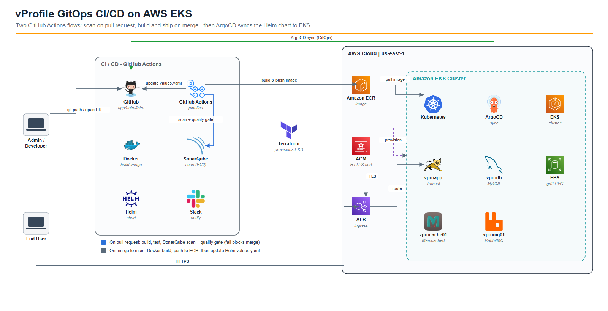

Sơ đồ (dùng logo gốc của từng dịch vụ) thể hiện vòng GitOps:

1. **Admin** push code lên **GitHub** (3 repo: app / helm / infra).
2. **GitHub Actions** chạy CI: **SonarQube** scan, **Docker** build image, đẩy lên **Amazon ECR**,
   rồi cập nhật `values.yaml` trong repo helm; báo kết quả qua **Slack**.
3. **Terraform** dựng **Amazon EKS** (VPC public subnet).
4. **ArgoCD** trong EKS theo dõi repo helm và **đồng bộ** chart xuống cluster (**Kubernetes**) gồm
   **vproapp** (Tomcat), **vprodb** (MySQL + **EBS**), **vprocache01** (Memcached), **vpromq01**
   (RabbitMQ).
5. Người dùng truy cập app qua **ALB** (HTTPS, chứng chỉ **ACM**).

Các định dạng nguồn của sơ đồ:
- [`docs/images/architecture.svg`](docs/images/architecture.svg) — vector, nét sắc ở mọi kích thước.
- [`docs/images/architecture.drawio`](docs/images/architecture.drawio) — mở/chỉnh bằng **VS Code**
  (extension *Draw.io Integration*) hoặc [app.diagrams.net](https://app.diagrams.net).

---

## 2. Yêu cầu chuẩn bị (Prerequisites)

- Tài khoản **GitHub** và `git` đã cài đặt.
- Tài khoản **AWS** với quyền tạo EC2, EKS, ALB, ACM, ECR.
- Công cụ CLI: `aws`, `eksctl`, `kubectl`, `helm`.
- Một **domain** đã trỏ về AWS (dùng cho Ingress, ví dụ `vprofile.kenzytran.click`).
- Một **certificate ARN** trong AWS Certificate Manager (ACM) cho domain ở trên (dùng HTTPS).
- Một công cụ **AI coding** (ví dụ Claude Code) để sinh Helm chart từ manifest.
- **VS Code** (hoặc editor bất kỳ) để chỉnh sửa và commit code.

---

# PHẦN A — Khởi tạo repo và Helm chart

## Bước 1 — Tạo 3 repo trên GitHub

Tạo 3 repo tương ứng với mô hình ở trên:

- `vprofile-app`
- `vprofile-helm`
- `vprofile-infra`

Clone về máy và đặt chung trong một thư mục làm việc (ví dụ `gitops/`):

```bash
git clone https://github.com/<username>/vprofile-app.git
git clone https://github.com/<username>/vprofile-helm.git
git clone https://github.com/<username>/vprofile-infra.git
```

## Bước 2 — Sinh Helm chart từ `kubedefs/` bằng AI coding

Trong repo `vprofile-helm` đã có sẵn thư mục `kubedefs/` (các manifest Kubernetes gốc). Dùng AI
coding với prompt mẫu dưới đây để chuyển chúng thành một Helm chart hoàn chỉnh trong `helm/vprofile`.

<details>
<summary><b>Prompt mẫu (bấm để mở)</b></summary>

```text
Create a Helm chart from the Kubernetes manifests in the kubedefs folder.

Requirements:
    Chart name: vprofile
    Folder structure: helm/vprofile
        Separate each resource type into individual template files (
        app-deployment.yaml, db-deployment.yaml, mc-deployment.yaml, rmq-deployment.yaml,
        services.yaml, ingress.yaml, secret.yaml, pvc.yaml, dockerregistry-secret.yaml)

Use separate variable sections for
app, db, memcached, rabbitmq, initcontainers, ingress, secrets, dockerregistry in values.yaml

One level nesting only in values.yaml

Variables:
    Common variables: image, tag, replicas, containerPort, servicePort, storageClass,
    storageSize, defaultUser
    ingress: enabled, host, servicePort
    dockerregistry: enabled, server, username, password, email

All image tags must default to latest — no empty tag values
image name and tag should be separate variables
db.storageClass must be set to gp2 for AWS EKS EBS volumes

Ingress must use AWS ALB controller with annotations
    kubernetes.io/ingress.class: alb
    alb.ingress.kubernetes.io/scheme: internet-facing
    alb.ingress.kubernetes.io/target-type: ip
    alb.ingress.kubernetes.io/certificate-arn: <Enter Your Certificate ARN>
    alb.ingress.kubernetes.io/listen-ports: '[{"HTTP":80},{"HTTPS":443}]'
    alb.ingress.kubernetes.io/ssl-redirect: '443'
    alb.ingress.kubernetes.io/backend-protocol: HTTP

Docker registry secret must be conditionally rendered with an enabled flag
dockerregistry.enabled defaults to false
Include imagePullSecrets in app and db deployments only when dockerregistry.enabled is true
initContainers use command not args

Keep it simple and minimal
```

</details>

Kết quả mong đợi — cấu trúc chart:

```
helm/vprofile/
├── Chart.yaml
├── values.yaml
└── templates/
    ├── app-deployment.yaml
    ├── db-deployment.yaml
    ├── mc-deployment.yaml
    ├── rmq-deployment.yaml
    ├── services.yaml
    ├── ingress.yaml
    ├── secret.yaml
    ├── pvc.yaml
    └── dockerregistry-secret.yaml
```

## Bước 3 — Thay giá trị riêng của bạn trong `values.yaml` và `ingress.yaml`

1. **Ingress host** — trong `helm/vprofile/values.yaml`, đổi `ingress.host` thành domain của bạn:

   ```yaml
   ingress:
     enabled: true
     host: vprofile.<domain-cua-ban>     # ví dụ: vprofile.kenzytran.click
     servicePort: 8080
   ```

2. **Certificate ARN** — trong `helm/vprofile/templates/ingress.yaml`, thay annotation
   `alb.ingress.kubernetes.io/certificate-arn` bằng ARN certificate của bạn trong ACM:

   ```yaml
   alb.ingress.kubernetes.io/certificate-arn: arn:aws:acm:<region>:<account-id>:certificate/<id>
   ```

3. (Tuỳ chọn) Đổi mật khẩu trong `secrets` — giá trị là chuỗi **base64**:

   ```bash
   echo -n 'mat-khau-cua-ban' | base64
   ```

> Kiểm tra nhanh chart render đúng trước khi đẩy lên cluster:
> ```bash
> helm lint helm/vprofile
> helm template vprofile helm/vprofile
> ```

Commit và push các thay đổi của `vprofile-helm`.

---

# PHẦN B — CI: Phân tích chất lượng code với SonarQube

Mục tiêu: mỗi khi push code lên `vprofile-app`, pipeline GitHub Actions sẽ gửi kết quả phân tích
lên **SonarQube server**. Trong phần này ta dựng server và chuẩn bị cấu hình; pipeline GitHub
Actions sẽ làm ở phần sau.

## Bước 4 — Khởi tạo source code cho `vprofile-app`

Source code lấy từ project gốc (nhánh chứa app + Dockerfile). Trong thư mục `vprofile-app` cần có:

```
vprofile-app/
├── src/                 # source code Java
├── pom.xml              # build bằng Maven
└── Docker-files/        # Dockerfile cho app, db, web
```

> Chưa cần commit ngay — sẽ commit chung sau khi thêm file cấu hình Sonar ở Bước 7.

## Bước 5 — Tạo SonarQube server trên EC2

Vào **AWS Console → EC2 → Launch Instance**:

| Mục | Giá trị |
|-----|---------|
| Name | `SonarServer` |
| AMI / OS | **Ubuntu** Server (bản LTS mới nhất, HVM, SSD) |
| Instance type | **t2.medium** (tối thiểu 4 GB RAM) |
| Key pair | Tạo mới tên **`SonarKey`** |
| Security group | Tạo mới tên **`sonar-sg`** |

**Security group `sonar-sg`** — mở các port:

| Port | Source | Lý do |
|------|--------|-------|
| 22 (SSH) | My IP | Đăng nhập quản trị (hiếm khi cần) |
| 80 (HTTP) | Anywhere (0.0.0.0/0) | GitHub Actions từ internet gửi kết quả lên SonarQube (qua Nginx reverse proxy) |

> Truy cập SonarQube qua **port 80** (Nginx proxy về `127.0.0.1:9000`). Bảo mật bằng **token**,
> không phải đăng nhập ẩn danh, nên mở port 80 ra internet là chấp nhận được cho bài thực hành.

**User data** — dán script dưới đây vào *Advanced details → User data*. Script sẽ tự động cài
Java 21, PostgreSQL, SonarQube 26.4 Community và Nginx rồi reboot:

<details>
<summary><b>User data script (bấm để mở)</b></summary>

```bash
#!/bin/bash

cp /etc/sysctl.conf /root/sysctl.conf_backup
cat <<EOT> /etc/sysctl.conf
vm.max_map_count=262144
fs.file-max=65536
EOT
sysctl -p

cp /etc/security/limits.conf /root/sec_limit.conf_backup
cat <<EOT> /etc/security/limits.conf
sonarqube - nofile 65536
sonarqube - nproc 4096
EOT

# === Java 21 (REQUIRED for SonarQube 26.4 / 2026 series) ===
sudo apt-get update -y
sudo apt-get install openjdk-21-jdk -y
sudo update-alternatives --config java
java -version

sudo apt update

# === PostgreSQL ===
wget -q https://www.postgresql.org/media/keys/ACCC4CF8.asc -O - | sudo apt-key add -
sudo sh -c 'echo "deb http://apt.postgresql.org/pub/repos/apt/ `lsb_release -cs`-pgdg main" >> /etc/apt/sources.list.d/pgdg.list'
sudo apt install postgresql postgresql-contrib -y

sudo systemctl enable --now postgresql.service

sudo echo "postgres:admin123" | chpasswd
runuser -l postgres -c "createuser sonar"
sudo -i -u postgres psql -c "ALTER USER sonar WITH ENCRYPTED PASSWORD 'admin123';"
sudo -i -u postgres psql -c "CREATE DATABASE sonarqube OWNER sonar;"
sudo -i -u postgres psql -c "GRANT ALL PRIVILEGES ON DATABASE sonarqube to sonar;"

systemctl restart postgresql

# === SonarQube 26.4.0.121862 Community Build ===
sudo mkdir -p /sonarqube/
cd /sonarqube/
sudo curl -O https://binaries.sonarsource.com/Distribution/sonarqube/sonarqube-26.4.0.121862.zip

sudo apt-get install zip -y
sudo unzip -o sonarqube-26.4.0.121862.zip -d /opt/
sudo mv /opt/sonarqube-26.4.0.121862 /opt/sonarqube

sudo groupadd sonar
sudo useradd -c "SonarQube - User" -d /opt/sonarqube/ -g sonar sonar
sudo chown sonar:sonar /opt/sonarqube/ -R

# Important for new Elasticsearch 8.x in 26.x
sudo chmod 1777 /tmp

# === sonar.properties (memory tuned for t2.medium) ===
cp /opt/sonarqube/conf/sonar.properties /root/sonar.properties_backup
cat <<EOT> /opt/sonarqube/conf/sonar.properties
sonar.jdbc.username=sonar
sonar.jdbc.password=admin123
sonar.jdbc.url=jdbc:postgresql://localhost/sonarqube
sonar.web.host=0.0.0.0
sonar.web.port=9000
sonar.web.javaAdditionalOpts=-server -Xmx1024m
sonar.search.javaOpts=-Xmx512m -Xms512m
sonar.log.level=INFO
sonar.path.logs=logs
EOT

# === systemd service ===
cat <<EOT> /etc/systemd/system/sonarqube.service
[Unit]
Description=SonarQube service
After=syslog.target network.target
[Service]
Type=forking
ExecStart=/opt/sonarqube/bin/linux-x86-64/sonar.sh start
ExecStop=/opt/sonarqube/bin/linux-x86-64/sonar.sh stop
User=sonar
Group=sonar
Restart=always
LimitNOFILE=65536
LimitNPROC=4096
[Install]
WantedBy=multi-user.target
EOT

systemctl daemon-reload
systemctl enable sonarqube.service

# === Nginx reverse proxy ===
apt-get install nginx -y
rm -rf /etc/nginx/sites-enabled/default
rm -rf /etc/nginx/sites-available/default
cat <<EOT> /etc/nginx/sites-available/sonarqube
server{
    listen 80;
    server_name sonarqube.groophy.in;
    access_log /var/log/nginx/sonar.access.log;
    error_log /var/log/nginx/sonar.error.log;
    proxy_buffers 16 64k;
    proxy_buffer_size 128k;
    location / {
        proxy_pass http://127.0.0.1:9000;
        proxy_next_upstream error timeout invalid_header http_500 http_502 http_503 http_504;
        proxy_redirect off;

        proxy_set_header Host \$host;
        proxy_set_header X-Real-IP \$remote_addr;
        proxy_set_header X-Forwarded-For \$proxy_add_x_forwarded_for;
        proxy_set_header X-Forwarded-Proto http;
    }
}
EOT
ln -s /etc/nginx/sites-available/sonarqube /etc/nginx/sites-enabled/sonarqube
systemctl enable nginx.service

sudo ufw allow 80,9000/tcp

echo "SonarQube 26.4.0.121862 installation completed. Rebooting in 15 seconds..."
sleep 15
reboot
```

</details>

> **Lưu ý:** `server_name sonarqube.groophy.in` là domain trong script gốc — không bắt buộc trỏ
> DNS, bạn vẫn truy cập được bằng **public IP** vì đây là Nginx server block mặc định. Nếu muốn,
> đổi `server_name` thành domain của bạn.

Bấm **Launch Instance** và chờ khoảng **5–10 phút** để script chạy xong và server reboot.

## Bước 6 — Đăng nhập SonarQube và tạo token

1. Mở trình duyệt tới **`http://<public-ip-sonar-server>`** (port 80).
2. Đăng nhập mặc định: user `admin` / password `admin`.
3. Hệ thống yêu cầu **đổi mật khẩu** — nhập mật khẩu cũ `admin` và đặt mật khẩu mới.
4. Tạo token: **Account (avatar) → My Account → Security**:
   - Name: `actions`
   - Type: **User Token**
   - Expires in: 30 days
   - Bấm **Generate** và **lưu lại token** (chỉ hiện một lần).

   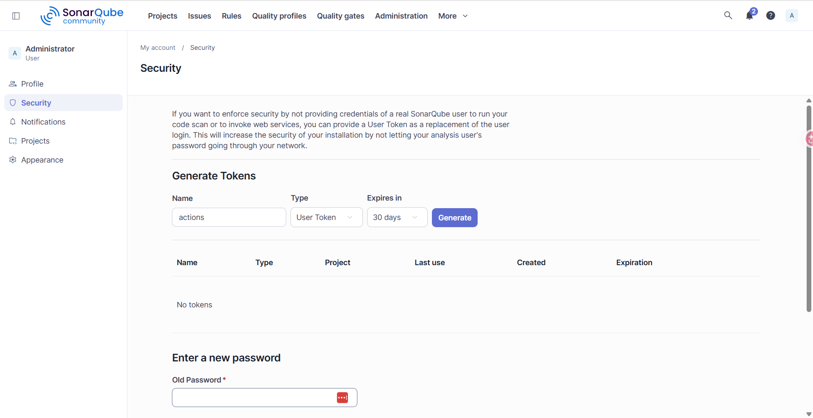

> Token này (cùng các key khác ở bước sau) sẽ được lưu vào **GitHub Secrets** để pipeline dùng.

## Bước 7 — Tạo `sonar-project.properties` và commit source

Tạo file `sonar-project.properties` ở **thư mục gốc** của repo `vprofile-app`:

```properties
sonar.projectKey=vprofile-app
sonar.projectName=vprofile-app
sonar.projectVersion=1.0
sonar.sources=src/
sonar.java.binaries=target/classes
sonar.junit.reportsPath=target/surefire-reports/
sonar.coverage.jacoco.xmlReportPaths=target/site/jacoco/jacoco.xml
sonar.java.checkstyle.reportPaths=target/checkstyle-result.xml
```

Giải thích:
- `projectKey` / `projectName`: định danh project trên SonarQube.
- `sources=src/`: thư mục code cần quét.
- `java.binaries=target/classes`: bytecode sinh ra sau khi build Maven.
- Các path `surefire-reports`, `jacoco`, `checkstyle`: báo cáo test/coverage/style để Sonar đọc.

Commit toàn bộ source + file cấu hình và push lên `main`:

```bash
cd vprofile-app
git add .
git commit -m "init"
git push origin main
```

Đến đây repo `vprofile-app` đã có đủ: source code, `pom.xml`, Dockerfile, `sonar-project.properties`,
và ta đã có **Sonar token**.

---

# PHẦN C — Registry, quyền truy cập và thông báo (ECR, IAM, Slack)

Phần này tạo các tài nguyên mà pipeline GitHub Actions sẽ dùng ở phần sau: nơi lưu Docker image
(**ECR**), tài khoản để pipeline xác thực với AWS (**IAM user**), và kênh báo kết quả (**Slack**).

> Mẹo tiết kiệm chi phí: nếu chưa dùng tới SonarServer, vào EC2 **Stop instance** để tạm tắt.

## Bước 8 — Tạo ECR repository

Vào **AWS Console → ECR (Elastic Container Registry) → Create repository**:

- Đảm bảo đang ở **đúng region** (nên cùng region với SonarServer — không bắt buộc nhưng gọn).
- Repository name: **`vprofileappimg`**
  > Giữ đúng tên này vì sẽ được tham chiếu trong pipeline. Nếu đổi tên, nhớ cập nhật trong pipeline.
- Bấm **Create**.

Sau khi tạo, **copy URI** của repository (dạng `<account-id>.dkr.ecr.<region>.amazonaws.com/vprofileappimg`)
và lưu lại để dùng sau.

## Bước 9 — Tạo IAM user cho GitHub Actions

Pipeline cần một IAM user để push image lên ECR và truy cập EKS.

Vào **AWS Console → IAM → Users → Create user**:

1. User name: **`github-actions`** (tên tuỳ ý).
2. **Next → Attach policies directly**, gắn 2 policy:

   | Policy | Mục đích |
   |--------|----------|
   | `AmazonEC2ContainerRegistryFullAccess` | Push/pull Docker image lên ECR |
   | `AmazonEKSClusterPolicy` | Để EKS cluster truy cập được registry |

3. Kiểm tra lại 2 policy rồi **Create user**.

**Tạo access key:**

4. Bấm vào username → tab **Security credentials → Create access key**.
5. Chọn use case **CLI**, tick *"I understand..."* → **Next → Create access key**.
6. **Download .csv file** chứa `Access key ID` và `Secret access key`.

> ⚠️ **Cảnh báo bảo mật:**
> - **Không bao giờ** commit access key vào Git repository (kể cả private repo).
> - Chỉ lưu vào **GitHub Secrets** (làm ở phần sau).
> - Khi thực hành xong, **deactivate hoặc xoá** access key / IAM user này.

## Bước 10 — Tạo Slack app và Incoming Webhook

Mục tiêu: pipeline gửi thông báo pass/fail vào một kênh Slack.

**Tạo workspace & channel** (có thể dùng workspace sẵn có):

1. Đăng nhập [slack.com](https://slack.com) → tạo workspace mới (ví dụ tên `sentinel`) hoặc dùng cái có sẵn.
2. Tạo **channel** mới: **`vprofile-actions`** (để **Private**).

**Tạo Slack app + webhook:**

3. Mở [api.slack.com/apps](https://api.slack.com/apps) → **Create New App → From scratch**.
   - App name: `vpro-act-notifications`
   - Pick a workspace: chọn workspace của bạn (`sentinel`) → **Create app**.
4. Vào menu **Incoming Webhooks → bật "Activate Incoming Webhooks"**.
5. Cuộn xuống **Add New Webhook to Workspace**.

   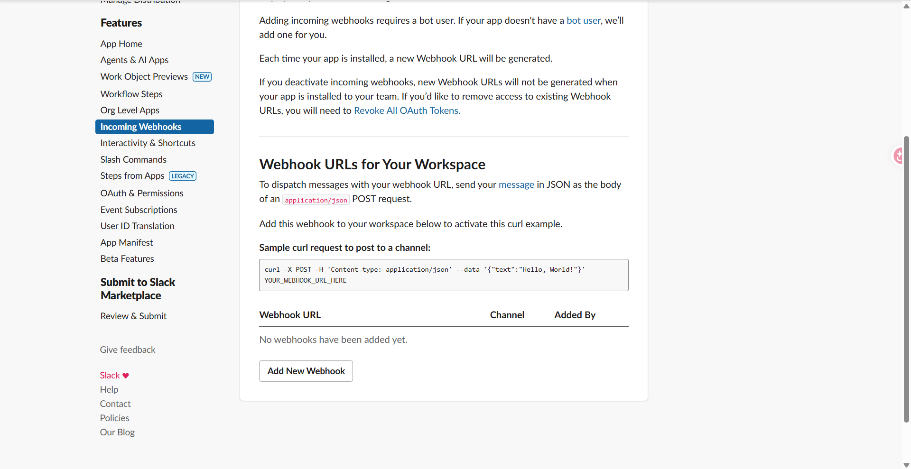

6. Chọn **Workspace** và **channel** `vprofile-actions` → bấm **Allow**.

   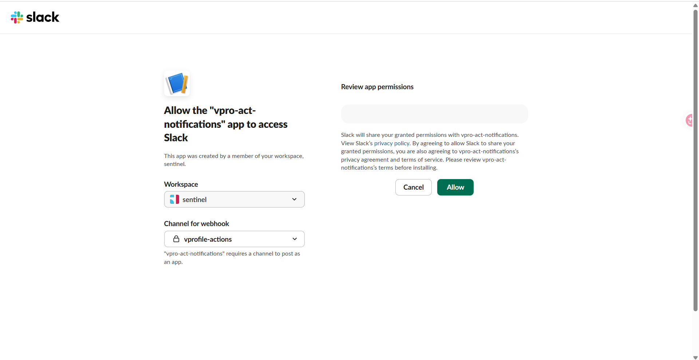

7. **Copy Webhook URL** và lưu lại.

**Kiểm tra webhook** (chạy từ Git Bash / Terminal) — nếu thành công sẽ thấy `Hello, World!` trong channel:

```bash
curl -X POST -H 'Content-type: application/json' \
  --data '{"text":"Hello, World!"}' \
  <YOUR_SLACK_WEBHOOK_URL>
```

## Tổng kết thông tin cần lưu (sẽ đưa vào GitHub Secrets)

Đến đây bạn đã thu thập đủ các giá trị sau:

| Thông tin | Lấy ở bước | Dùng để |
|-----------|-----------|---------|
| **Sonar token** | Bước 6 | Pipeline gửi kết quả scan lên SonarQube |
| **ECR repository URI** | Bước 8 | Push Docker image |
| **AWS Access Key ID / Secret** | Bước 9 | Xác thực AWS trong pipeline |
| **Slack Webhook URL** | Bước 10 | Gửi thông báo pass/fail |

---

# PHẦN D — GitHub PAT và lưu Secrets/Variables

Cuối pipeline CI (trong `vprofile-app`), pipeline sẽ **commit cập nhật `values.yaml` sang repo
`vprofile-helm`**. Để làm được, pipeline cần xác thực với repo helm bằng **GitHub PAT (Personal
Access Token) + username**. Phần này tạo PAT và lưu toàn bộ thông tin đã thu thập vào GitHub.

## Bước 11 — Tạo GitHub PAT (Personal Access Token)

> Tạo PAT trong **tài khoản sở hữu repo `vprofile-helm`**. Nếu repo app và helm cùng một tài khoản
> (như bài thực hành này) thì dùng luôn tài khoản đó.

1. Vào **GitHub → Settings → Developer settings** (cuối trang) **→ Personal access tokens →
   Tokens (classic)**.
2. **Generate new token → Generate new token (classic)** (có thể yêu cầu nhập lại mật khẩu).
3. Cấu hình:
   - **Note**: `gitops-pipeline`
   - **Expiration**: 30 days
   - **Scopes**: tick **`repo`** (để commit được vào repository)
   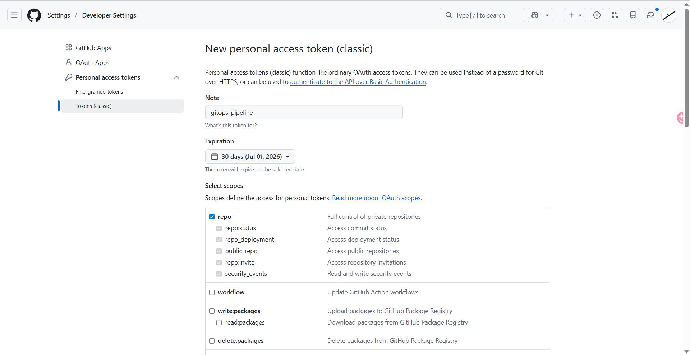

4. **Generate token** → **copy và lưu lại PAT** (chỉ hiện một lần).
5. Ghi lại luôn **GitHub username** của bạn (ví dụ `devops4sure` / `KenzyTran`).

## Bước 12 — Lưu GitHub Secrets

Vào repo **`vprofile-app` → Settings → Secrets and variables → Actions → tab Secrets →
New repository secret**. Tạo lần lượt các secret (giữ **đúng tên** vì pipeline tham chiếu theo tên):

| Secret name | Giá trị | Nguồn |
|-------------|---------|-------|
| `AWS_ACCESS_KEY_ID` | Access key ID của IAM user | Bước 9 (file CSV) |
| `AWS_SECRET_ACCESS_KEY` | Secret access key của IAM user | Bước 9 (file CSV) |
| `SONAR_TOKEN` | Token SonarQube | Bước 6 |
| `HELM_REPO_USER` | GitHub username (sở hữu repo helm) | Bước 11 |
| `GITOPS_PAT` | GitHub Personal Access Token | Bước 11 |
| `SLACK_WEBHOOK` | Slack Incoming Webhook URL | Bước 10 |

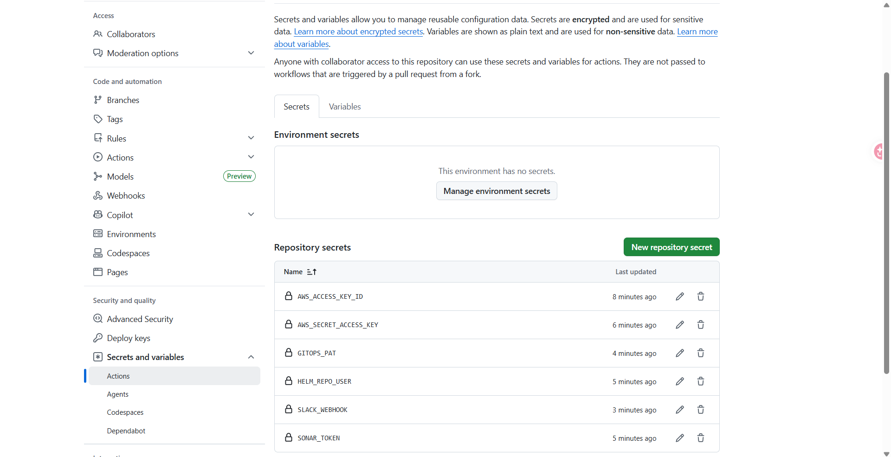

> Secret **không xem lại được** sau khi lưu. Nếu nhập sai, phải xoá và tạo lại. Hãy copy thật cẩn thận.

## Bước 13 — Lưu GitHub Variables

Sang tab **Variables → New repository variable**. Đây là các giá trị không nhạy cảm (xem lại được):

| Variable name | Giá trị (ví dụ) | Ý nghĩa |
|---------------|-----------------|---------|
| `AWS_REGION` | `us-east-1` | Region đang dùng (cùng region ECR/Sonar) |
| `ECR_REPOSITORY` | `vprofileappimg` | Tên ECR repo (Bước 8) |
| `HELM_REPO_NAME` | `vprofile-helm` | Tên repo helm để pipeline commit vào |
| `SONAR_HOST_URL` | `http://<sonar-public-ip>/` | URL SonarServer — xem ghi chú bên dưới |

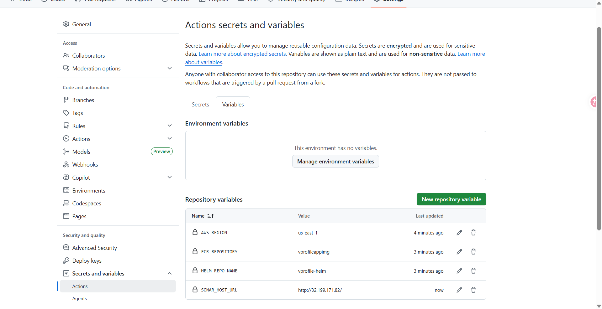

> Khác biệt giữa **Secret** và **Variable**: Variable xem lại được giá trị; Secret thì không.

> 🔜 Biến **`SONAR_HOST_URL`** dùng public IP của SonarServer. Vì IP đổi mỗi lần bật/tắt instance,
> hãy **cập nhật lại giá trị này mỗi khi bật lại SonarServer** trước khi chạy pipeline (ví dụ
> `http://32.199.171.82/`). Đây cũng là thời điểm ta tạo pipeline GitHub Actions.

---

# PHẦN E — Pipeline CI/CD với GitHub Actions

Tạo pipeline GitHub Actions cho repo `vprofile-app`. Pipeline làm những việc đã quen (build, test,
scan) và **thêm một việc mới ở cuối: cập nhật `values.yaml` trong repo `vprofile-helm`**.

Triết lý làm việc đúng chuẩn: mọi thay đổi làm trên **feature branch**, không phải `main`.

## Bước 14 — Tạo feature branch

Mở Git Bash / Terminal tại repo `vprofile-app` (đang ở `main`), tạo và chuyển sang nhánh mới:

```bash
cd vprofile-app
git checkout -b feature-X
```

> Mô phỏng việc developer phát triển tính năng mới trên nhánh riêng. Mở VS Code và đảm bảo đang ở
> nhánh `feature-X` trước khi sinh pipeline.

## Bước 15 — Sinh pipeline bằng AI coding (GitHub Copilot)

Dùng prompt mẫu dưới đây cho Copilot/AI để sinh file `.github/workflows/ci.yml`. Prompt mô tả đầy
đủ luồng, công cụ, action dùng sẵn, secrets/variables — để AI sinh ra pipeline sát nhất.

<details>
<summary><b>Prompt mẫu sinh CI/CD pipeline (bấm để mở)</b></summary>

```text
I have a Java Spring MVC application built with Maven. I need a GitHub Actions
CI/CD pipeline with the following exact flow:

1. feature branch push → no pipeline runs
2. PR to main → run: Maven build, unit tests, Checkstyle, SonarQube scan,
   SonarQube quality gate check. Block merge if quality gate fails.
3. merge to main → build Docker image, push to Amazon ECR with commit SHA and latest as
   tag, then update the image and SHA tag fields in a Helm values.yaml file in a
   separate Helm GitHub repo.

Details:
- Java 21, Maven, Tomcat, WAR packaging
- SonarQube is self-hosted on EC2 (not SonarCloud), use
  sonarsource/sonarqube-scan-action@v2 and
  sonarsource/sonarqube-quality-gate-action@v1.1.0
  Use exsiting sonar-project.properties  for sonar settings.

- Add Maven and SonarQube dependency caching to speed up PR builds

- Dockerfile is at Docker-files/app/multistage/Dockerfile

- ECR repository name: vprofileappimg, region: us-east-1

- Add Maven and SonarQube dependency caching to speed up PR builds

- Helm repo name: vprofile-helm, values file path:
  helm/vprofile/values.yaml

- Structure of values.yaml file.
    app:
      image:
      tag:
      replicas: 1
      containerPort: 8080
      servicePort: 8080

- The values.yaml has an app.image and app.tag field that need to be updated
  using yq

- Use GitHub secrets: SONAR_TOKEN, AWS_ACCESS_KEY_ID, AWS_SECRET_ACCESS_KEY,
  HELM_REPO_USER, GITOPS_PAT

- Pass ECR registry and image tag between jobs using job outputs

- The docker and helm jobs must NOT run on PRs, only on push to main
```

</details>

Pipeline tham chiếu đúng các **secrets** và **variables** đã tạo ở Phần D:

| GitHub Secrets | GitHub Variables |
|----------------|------------------|
| `SONAR_TOKEN` | `AWS_REGION` |
| `AWS_ACCESS_KEY_ID` | `ECR_REPOSITORY` |
| `AWS_SECRET_ACCESS_KEY` | `HELM_REPO_NAME` |
| `HELM_REPO_USER` | `SONAR_HOST_URL` |
| `GITOPS_PAT` | |
| `SLACK_WEBHOOK` | |

> Lưu ý: prompt **không liệt kê `SLACK_WEBHOOK`** — bước thông báo Slack thường bị AI bỏ sót và được
> **thêm vào sau** (xem Bước 16). Secret `SLACK_WEBHOOK` thì đã có sẵn trong GitHub.

> AI có thể hỏi xác nhận (vd cho phép kiểm tra action SonarQube trên GitHub) — cứ đồng ý. Sinh xong
> chọn **Keep** rồi rà soát lại theo Bước 16.

### Cấu trúc `ci.yml` mong đợi

```yaml
name: vProfile CI/CD

on:
  push:
    branches: [ main ]          # merge vào main -> docker + helm jobs
  pull_request:
    branches: [ main ]          # PR vào main -> sonar job

jobs:
  build-and-sonar:              # chỉ chạy khi event là pull_request
    if: github.event_name == 'pull_request'
    # checkout -> setup JDK 21 -> cache Maven/Sonar
    # mvn build + unit test
    # mvn verify checkstyle:checkstyle -B
    # sonarqube-scan-action@v2 -> sonarqube-quality-gate-action@v1.1.0 (block nếu fail)

  docker-build-push:            # chỉ chạy khi event là push (đã merge vào main)
    if: github.event_name == 'push'
    # outputs: image_tag + ecr_registry  (truyền sang job sau qua job outputs)
    # checkout -> configure AWS credentials (access key/secret) -> ECR login
    # docker build -f Docker-files/app/multistage/Dockerfile
    # tag = <commit-sha> và latest -> push cả 2 tag lên ECR

  update-helm:                  # chỉ chạy khi push, cần docker-build-push xong trước
    if: github.event_name == 'push'
    needs: docker-build-push
    # checkout repo helm (dùng GITOPS_PAT) -> cài yq
    # yq cập nhật app.image + app.tag trong helm/vprofile/values.yaml
    # git add/commit/push sang vprofile-helm
```

## Bước 16 — Rà soát và dọn pipeline sau khi sinh

AI thường thêm thừa hoặc sai vài chỗ. Kiểm tra và sửa các điểm sau:

| Vấn đề thường gặp | Cách xử lý |
|-------------------|-----------|
| Thêm `role-to-assume` / OIDC ở bước cấu hình AWS | **Xoá** — chỉ dùng access key + secret key |
| Thiếu bước thông báo **Slack** | Thêm step gửi `SLACK_WEBHOOK` cho pass/fail |
| Định nghĩa lại biến đã có trong GitHub Variables | Bỏ — dùng trực tiếp `${{ vars.* }}` |
| Lệnh Checkstyle quá rườm rà | Rút gọn: `mvn verify checkstyle:checkstyle -B` (`-B` = batch mode, log gọn) |
| Bước "create ECR repository if needed" | Không cần (đã tạo ở Bước 8) — có thể xoá |
| `yq` cập nhật `values.yaml` sai cách (match theo giá trị cũ) | Sửa để cập nhật **theo key path** `app.image`/`app.tag`, không phụ thuộc giá trị hiện tại |
| Thiếu variable `SONAR_HOST_URL` | Đảm bảo đã tạo (Bước 13) và cập nhật IP SonarServer trước khi chạy |

> 💡 Mẹo của tác giả: làm từng phần một, đến khi pipeline chạy ổn thì nhờ AI "viết lại prompt sinh ra
> đúng pipeline này" để tái sử dụng lần sau. AI sẽ luôn sai đôi chút — đó là điều bình thường.

---

# PHẦN F — Chạy pipeline qua Pull Request

Nguyên tắc GitOps/GitHub: nhánh `main` luôn được bảo vệ. Mọi thay đổi đi qua **feature branch →
Pull Request → merge**. Pipeline chỉ chạy khi có **PR vào main** (job sonar) hoặc **push/merge vào
main** (job docker + helm), không chạy khi push lên feature branch.

## Bước 17 — Commit pipeline vào feature branch

Tại repo `vprofile-app`, đảm bảo đang ở nhánh `feature-X`, commit file `ci.yml` và push:

```bash
cd vprofile-app
git add .
git commit -m "Pipeline"
git push origin feature-X
```

> Push lên feature branch **không kích hoạt** pipeline nào. Kiểm tra tab **Actions** — không có
> workflow nào chạy. Pipeline chỉ chạy khi raise Pull Request.

## Bước 18 — Cập nhật biến `SONAR_HOST_URL`

Job sonar dùng `${{ vars.SONAR_HOST_URL }}` để kết nối SonarServer. Đảm bảo biến này trỏ đúng:

- Định dạng là **URL**, không chỉ IP: `http://<public-ip-sonar-server>`
- Nginx của SonarServer nghe trên **port 80** (mặc định HTTP nên không cần `:80`). Nếu dùng port
  khác thì phải ghi rõ.

> ⚠️ **Public IP đổi mỗi lần Stop/Start EC2.** Nếu bạn vừa bật lại SonarServer, lấy public IP mới và
> **cập nhật lại** `SONAR_HOST_URL` (Settings → Secrets and variables → Actions → Variables), rồi
> chờ ~5 phút cho SonarQube khởi động đủ dịch vụ trước khi raise PR. *(Nếu không tắt server thì IP
> không đổi, bỏ qua bước cập nhật này.)*

## Bước 19 — Raise Pull Request (chạy job Sonar)

1. Vào repo `vprofile-app` → tab **Pull requests → New pull request**.
2. Chọn merge **`feature-X` → `main`** (chú ý mũi tên: base = `main`, compare = `feature-X`).
3. (Tuỳ chọn) đặt title/description → **Create pull request**.

PR sẽ kích hoạt **chỉ job `build-and-sonar`**; hai job `docker-build-push` và `update-helm` bị
**skip** (vì chỉ chạy khi push vào main):

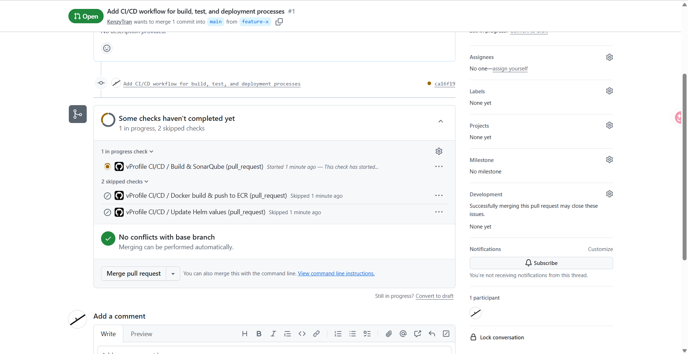

Pipeline thực hiện: checkout → build → unit test → checkstyle → SonarQube scan → quality gate check.
Khi xong, run hiển thị **Success**, job `Build & SonarQube` pass còn `Docker build & push to ECR` và
`Update Helm values` ở trạng thái skipped:

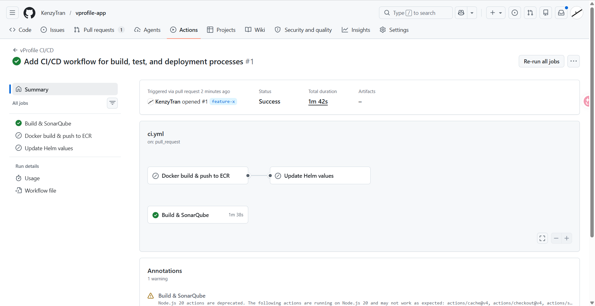

## Bước 20 — Kiểm tra Quality Gate trên SonarQube

Mở SonarServer (`http://<sonar-ip>`) → thấy project **`vprofile-app`** xuất hiện với kết quả phân tích.

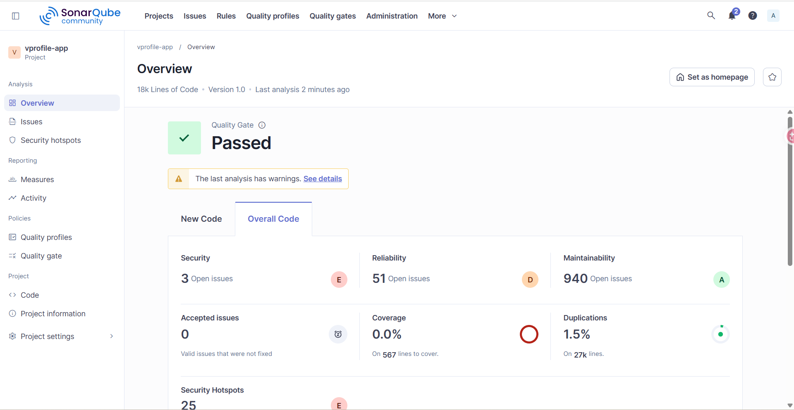

- Mặc định dùng **default quality gate**.
- Nếu quality gate **fail**, không thể merge vào `main` (đúng thiết kế). Bạn có thể:
  - Sửa code cho đạt chuẩn, hoặc
  - Tạo **custom quality gate** rồi gắn vào project và set theo yêu cầu (để hoàn thành bài thực hành).

## Bước 21 — Merge và chạy job Docker + Helm

Khi check + quality gate **pass**, trong PR bấm **Merge pull request → Confirm merge**.

Merge = **push vào `main`** → kích hoạt 2 job còn lại:

- **`docker-build-push`**: build Docker image (Dockerfile multistage) → push lên ECR với **2 tag**:
  `<commit-sha>` và `latest`.
- **`update-helm`**: clone repo `vprofile-helm` (dùng `GITOPS_PAT`) → dùng `yq` cập nhật `app.image`
  và `app.tag` trong `helm/vprofile/values.yaml` → commit & push.

Lúc này run được trigger qua **push vào main**, job `Docker build & push to ECR` và `Update Helm
values` chạy (Build & SonarQube skipped):

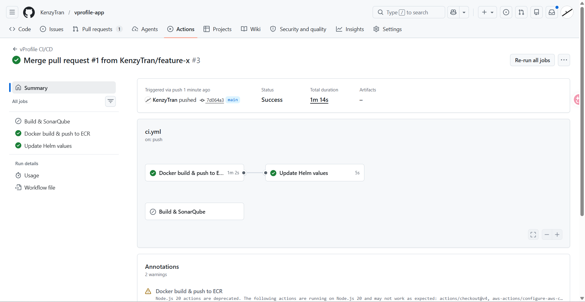

## Bước 22 — Xác minh kết quả

- **ECR** (`vprofileappimg`): thấy image với tag commit SHA + tag `latest`.

  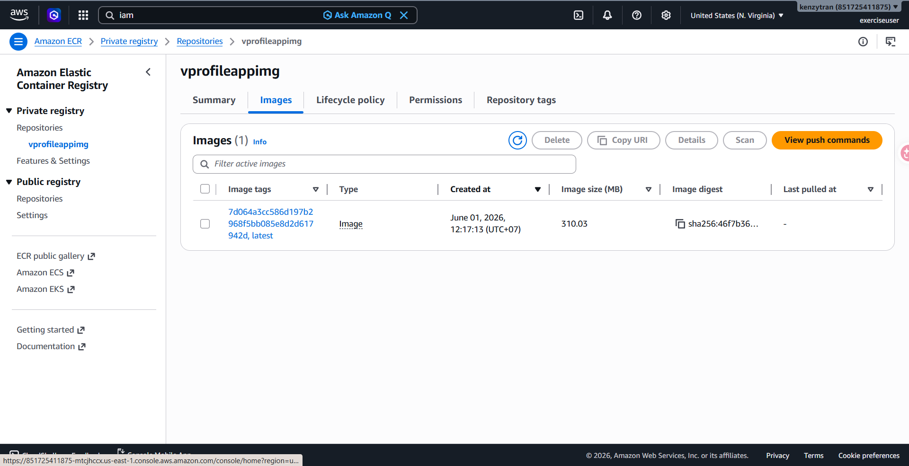

- **Repo `vprofile-helm`** → `helm/vprofile/values.yaml`: `app.image` và `app.tag` đã được cập nhật
  bằng image vừa build.

> ✅ Đến đây pipeline CI hoàn chỉnh: code → scan/quality gate → build/push image → tự động cập nhật
> `values.yaml` ở repo helm. Đây chính là phần "CI" của GitOps; phần "CD" (ArgoCD sync) làm ở sau.

---

# PHẦN G — Chuẩn bị cho EKS + ArgoCD (Terraform prerequisites)

Mục tiêu phần này (CD): dùng **Terraform** dựng **EKS cluster** trên AWS và cấu hình để chạy được
vProfile + **ArgoCD**. Trước khi viết Terraform, cần chuẩn bị domain, công cụ local, và IAM user.

## Bước 23 — Domain và public certificate (ACM)

Để truy cập vProfile app và ArgoCD qua **HTTPS bảo mật**, cần:

- Một **domain** (ví dụ mua ở GoDaddy hoặc nhà cung cấp khác — đã dùng `kenzytran.click` ở Phần A).
- Một **public certificate** trong **AWS Certificate Manager (ACM)** cho domain đó (miễn phí).

> Đây là phần đã chuẩn bị từ trước (cert ARN dùng trong `ingress.yaml` ở Bước 3). Nếu không muốn
> mua domain, bạn vẫn xem/theo dõi được, nhưng sẽ không có URL HTTPS đẹp cho app và ArgoCD.

## Bước 24 — Cài công cụ trên máy local

Terraform sẽ chạy **từ máy của bạn**. Cần các công cụ: `aws` (AWS CLI), `terraform`, `kubectl`,
`helm`, `eksctl`.

**Windows** — mở **PowerShell as Administrator**:

```powershell
# Cài bằng Chocolatey
choco install awscli terraform kubernetes-cli kubernetes-helm -y

# Cài Scoop rồi cài eksctl
Set-ExecutionPolicy -ExecutionPolicy RemoteSigned -Scope CurrentUser
Invoke-RestMethod -Uri https://get.scoop.sh | Invoke-Expression
scoop install eksctl
```

**macOS** — dùng Homebrew:

```bash
brew install awscli terraform kubernetes-cli helm eksctl
```

> Kiểm tra cài đặt: `aws --version`, `terraform -version`, `kubectl version --client`,
> `helm version`, `eksctl version`.

## Bước 25 — Tạo IAM user quyền Administrator (cho Terraform)

Terraform cần quyền rộng để tạo EKS, VPC, EC2... nên dùng user có **AdministratorAccess**.

Vào **IAM → Users → Create user**:

1. User name: ví dụ `terraform-admin`.
2. **Attach policies directly** → chọn **`AdministratorAccess`**.
3. **Create user**.
4. Vào user → **Security credentials → Create access key → CLI** → tick xác nhận → tạo và
   **download** access key + secret key.

> ⚠️ Key này có **quyền admin** — chỉ lưu trên máy bạn, **không** commit lên Git. **Xoá key/user
> ngay khi thực hành xong.**

## Bước 26 — Cấu hình AWS CLI (`aws configure`)

Nạp access key vào máy local để Terraform dùng:

```bash
aws configure
# AWS Access Key ID:     <access key của terraform-admin>
# AWS Secret Access Key: <secret key>
# Default region name:   us-east-1
# Default output format: json
```

> Đặt region khớp với region bạn dùng cho ECR/Sonar (ở đây `us-east-1`).

## Bước 27 — Mở repo `vprofile-infra`

Mở repo hạ tầng trong VS Code để chuẩn bị viết Terraform:

```bash
cd vprofile-infra
code .
```

---

# PHẦN H — Dựng EKS cluster bằng Terraform

Dùng AI coding sinh Terraform trong repo `vprofile-infra` để dựng EKS cluster tối giản (tiết kiệm
chi phí), rồi thêm EBS CSI Driver để DB tạo được volume.

> Tóm tắt prereq (đã làm ở Phần G): có domain + ACM cert, đã cài `aws/terraform/kubectl/helm/eksctl`,
> đã tạo IAM user `AdministratorAccess` và chạy `aws configure`.

## Bước 28 — Mở repo và cấu hình AI coding

1. Clone repo `vprofile-infra` (nên dùng **SSH key**) và mở bằng VS Code (`code .`).
2. Cấu hình công cụ AI trong VS Code: **Amazon Q** (hoặc GitHub Copilot) để sinh Terraform.

## Bước 29 — Sinh Terraform code cho EKS cluster

Dùng prompt sau cho AI để sinh 4 file Terraform:

<details>
<summary><b>Prompt sinh Terraform EKS (bấm để mở)</b></summary>

```text
Create minimal Terraform configuration for AWS EKS cluster with these requirements:

Files to create:
- main.tf: Core infrastructure (VPC, subnets, IAM roles, EKS cluster, node group)
- variables.tf: All configurable parameters
- outputs.tf: Essential cluster information
- backend.tf: S3 backend

Specifications:
- Region: us-east-1
- Cluster name: vprofile-eks-cluster
- Backend: S3 backend without dynamodb locking
- VPC: 10.0.0.0/16 with ONLY public subnets across 2 AZs
- Node group: 1 t3.large instance (min=1, max=2, desired=1) in public subnets
- Use minimal resources for cost optimization - NO private subnets, NO NAT gateways

Network Architecture:
- Create only public subnets with direct internet access
- Place EKS cluster and worker nodes in public subnets
- Include proper EKS subnet tags for load balancer integration

Outputs to include:
- cluster_endpoint, cluster_name, cluster_arn

Code Quality Requirements:
- Ensure all code is properly formatted with `terraform fmt`
- Use consistent indentation and spacing
- Follow Terraform best practices for readability

Keep code minimal - only essential components for functional EKS cluster with public subnet
architecture.
```

</details>

Điểm quan trọng trong thiết kế (để tiết kiệm chi phí thực hành):
- **Chỉ public subnet** trên 2 AZ, **không** private subnet / NAT gateway.
- Node group **1 x t3.large** (min=1, max=2, desired=1).
- S3 backend (lưu state), **không** dùng DynamoDB lock.
- Subnet có **tag cho ALB** để Load Balancer Controller tích hợp được.

> Lưu ý: backend S3 cần một **S3 bucket có sẵn** để lưu state — tạo trước khi `terraform init`. Ví dụ
> `backend.tf` của bài này dùng bucket `gitops-terraformcode-2026`, key `eks/terraform.tfstate`:
> ```bash
> aws s3 mb s3://gitops-terraformcode-2026 --region us-east-1
> ```
> Đặt tên bucket của bạn (S3 bucket name là duy nhất toàn cầu) và sửa lại trong `backend.tf`.

## Bước 30 — Review và apply Terraform

Sau khi AI sinh code, **review cả 4 file** (`main.tf`, `variables.tf`, `outputs.tf`, `backend.tf`),
rồi chạy:

```bash
terraform init
terraform plan
terraform apply       # gõ "yes" khi được hỏi
```

> Dựng EKS cluster mất khoảng **15–20 phút**. Sau khi xong, kết nối kubectl:
> ```bash
> aws eks update-kubeconfig --name vprofile-eks-cluster --region us-east-1
> kubectl get nodes
> ```

## Bước 31 — Thêm EBS CSI Driver (IRSA)

DB (`vprodb`) dùng PVC với `storageClass: gp2` → cần **EBS CSI Driver** để EKS tự tạo EBS volume.
Dùng prompt sau để bổ sung vào Terraform:

<details>
<summary><b>Prompt thêm EBS CSI Driver (bấm để mở)</b></summary>

```text
Add EBS CSI Driver IRSA to EKS cluster in Terraform:

1. Associate OIDC provider with EKS cluster
2. Create IAM role "AmazonEKS_EBS_CSI_DriverRole" with OIDC trust relationship
3. Attach policy "arn:aws:iam::aws:policy/service-role/AmazonEBSCSIDriverPolicy"
4. Enable the aws-ebs-csi-driver addon with the service account role ARN
5. Do NOT create a Kubernetes service account - AWS addon will create it.
```

</details>

Apply lại (dùng `-upgrade` vì có thể thêm provider/module mới):

```bash
terraform init -upgrade
terraform plan
terraform apply       # gõ "yes"
```

> IRSA = IAM Roles for Service Accounts: gắn IAM role vào service account của addon qua OIDC, để
> driver có quyền gọi API EBS mà không cần access key trong cluster.

> 📌 Trong `vprofile-infra` của bài này, toàn bộ phần OIDC provider + role `AmazonEKS_EBS_CSI_DriverRole`
> + addon `aws-ebs-csi-driver` đã nằm sẵn trong `main.tf` (sinh chung với EKS), nên chỉ cần
> `terraform apply` một lần là đủ.

---

# PHẦN I — Cài AWS Load Balancer Controller và ArgoCD

EKS không tự tạo ALB cho Ingress. Cần cài **AWS Load Balancer Controller** để Ingress (annotation
`alb`) tạo được Application Load Balancer. Sau đó cài **ArgoCD** và expose qua HTTPS.

## Bước 32 — Cài AWS Load Balancer Controller

**1. Tải IAM policy và tạo policy:**

```bash
curl -O https://raw.githubusercontent.com/kubernetes-sigs/aws-load-balancer-controller/main/docs/install/iam_policy.json

aws iam create-policy \
  --policy-name AWSLoadBalancerControllerIAMPolicy \
  --policy-document file://iam_policy.json
```

**2. Tạo IAM service account (IRSA) cho controller** — thay `<account-id>` bằng AWS account của bạn:

```bash
eksctl create iamserviceaccount \
  --cluster vprofile-eks-cluster \
  --namespace kube-system \
  --name aws-load-balancer-controller \
  --attach-policy-arn arn:aws:iam::<account-id>:policy/AWSLoadBalancerControllerIAMPolicy \
  --approve \
  --region us-east-1

aws eks update-kubeconfig --name vprofile-eks-cluster --region us-east-1
```

**3. Cài cert-manager (controller cần webhook TLS) và chờ sẵn sàng:**

```bash
kubectl apply --validate=false \
  -f https://github.com/cert-manager/cert-manager/releases/download/v1.16.1/cert-manager.yaml

kubectl wait --for=condition=available --timeout=180s \
  deployment/cert-manager \
  deployment/cert-manager-cainjector \
  deployment/cert-manager-webhook \
  -n cert-manager
```

**4. Cài controller bằng Helm** — thay `<EKS-VPC-ID>` bằng VPC id của cluster:

```bash
# Lấy VPC id của cluster:
aws eks describe-cluster --name vprofile-eks-cluster --region us-east-1 \
  --query "cluster.resourcesVpcConfig.vpcId" --output text

helm repo add eks https://aws.github.io/eks-charts
helm repo update

helm upgrade --install aws-load-balancer-controller eks/aws-load-balancer-controller \
  -n kube-system \
  --set clusterName=vprofile-eks-cluster \
  --set region=us-east-1 \
  --set vpcId=<EKS-VPC-ID> \
  --set serviceAccount.create=false \
  --set serviceAccount.name=aws-load-balancer-controller
```

**5. Kiểm tra controller chạy ổn:**

```bash
kubectl get pods -n kube-system -l app.kubernetes.io/name=aws-load-balancer-controller
kubectl get endpoints aws-load-balancer-webhook-service -n kube-system
kubectl logs -n kube-system deployment/aws-load-balancer-controller --tail=30
```

## Bước 33 — Cài ArgoCD

```bash
helm repo add argo https://argoproj.github.io/argo-helm
helm repo update

helm upgrade argocd argo/argo-cd --version 9.5.2 --install --create-namespace -n argocd

# Chờ argocd-server sẵn sàng
kubectl rollout status deployment argocd-server -n argocd
```

## Bước 34 — Tạo Ingress cho ArgoCD

**Lấy ACM certificate ARN của bạn:**

```bash
aws acm list-certificates --region us-east-1 \
  --query "CertificateSummaryList[*].{Domain:DomainName, ARN:CertificateArn}" \
  --output table
```

Tạo file `argocd-ingress.yaml` (thay `<YourCertificate-ARN>` và `<YourDomain>`):

```yaml
apiVersion: networking.k8s.io/v1
kind: Ingress
metadata:
  name: argocd-ingress
  namespace: argocd
  annotations:
    kubernetes.io/ingress.class: alb
    alb.ingress.kubernetes.io/scheme: internet-facing
    alb.ingress.kubernetes.io/target-type: ip
    alb.ingress.kubernetes.io/certificate-arn: <YourCertificate-ARN>
    alb.ingress.kubernetes.io/listen-ports: '[{"HTTP":80},{"HTTPS":443}]'
    alb.ingress.kubernetes.io/ssl-redirect: '443'
    alb.ingress.kubernetes.io/backend-protocol: HTTPS
spec:
  rules:
  - host: argocd.<YourDomain>
    http:
      paths:
      - path: /
        pathType: Prefix
        backend:
          service:
            name: argocd-server
            port:
              number: 443
```

> `backend-protocol: HTTPS` và port `443` vì argocd-server chạy HTTPS nội bộ.

Apply và lấy DNS name của ALB (chờ vài phút tới khi cột ADDRESS hiện endpoint):

```bash
kubectl apply -f argocd-ingress.yaml
kubectl get ingress argocd-ingress -n argocd -w
```

## Bước 35 — Cấu hình DNS (GoDaddy)

Thêm bản ghi **CNAME** trong DNS của domain để trỏ `argocd.<domain>` về ALB:

| Type | Name | Value |
|------|------|-------|
| CNAME | `argocd` | `<ALB-DNS-endpoint>` (từ cột ADDRESS ở Bước 34) |

## Bước 36 — Truy cập ArgoCD

Lấy mật khẩu admin ban đầu:

```bash
kubectl -n argocd get secret argocd-initial-admin-secret \
  -o jsonpath="{.data.password}" | base64 -d
```

Đăng nhập:

- **URL:** `https://argocd.<YourDomain>`
- **Username:** `admin`
- **Password:** kết quả lệnh trên

> Sau khi đăng nhập, **đổi mật khẩu** trong UI (User Info → Update Password).

---

# PHẦN J — Cấu hình ArgoCD đồng bộ vProfile (GitOps CD)

Ý tưởng: **ArgoCD đọc Helm chart từ repo `vprofile-helm`** và triển khai xuống EKS. Khi pod app
khởi chạy, EKS **pull image từ ECR** → cần 2 việc: (1) cấp cho ArgoCD quyền đọc Git repo, (2) cấp
cho node EKS quyền đọc ECR.

## Bước 37 — Đăng nhập ArgoCD CLI và thêm Git repo

```bash
# Đăng nhập (nhập password admin khi được hỏi)
argocd login argocd.<YourDomain> --username admin

# Thêm repo helm bằng SSH key (key private đã tạo để xác thực Git cho 3 repo)
argocd repo add git@github.com:<YourGithubAccount>/vprofile-helm.git \
  --ssh-private-key-path ~/.ssh/<Keyname>
```

> Nếu lệnh báo lỗi lần đầu, thử lại — thường lần 2 là được. Có thể thêm repo qua **UI**:
> Settings → Repositories → Connect repo, dán nội dung private key.

## Bước 38 — Cấp quyền ECR cho node group EKS

Node EKS cần quyền pull image từ ECR.

> 📌 **Bài này không cần làm thủ công:** Terraform `vprofile-infra` đã gắn sẵn
> `AmazonEC2ContainerRegistryReadOnly` vào node role (`main.tf`), nên node đã pull được image từ ECR.
> Phần dưới đây để tham khảo khi node role **chưa** có policy đó.

```bash
# 1. Tìm tên node group
aws eks list-nodegroups --cluster-name vprofile-eks-cluster --region us-east-1

# 2. Tìm IAM role gắn với node group (thay <ng-name>)
aws eks describe-nodegroup \
  --cluster-name vprofile-eks-cluster \
  --nodegroup-name <ng-name> \
  --region us-east-1 \
  --query "nodegroup.nodeRole" --output text

# 3. Gắn policy đọc ECR vào role (thay <node-role>)
aws iam attach-role-policy \
  --role-name <node-role> \
  --policy-arn arn:aws:iam::aws:policy/AmazonEC2ContainerRegistryReadOnly

# 4. Kiểm tra policy đã gắn
aws iam list-attached-role-policies --role-name <node-role> --output table
```

> Node chỉ cần **pull** nên dùng `AmazonEC2ContainerRegistryReadOnly` (least privilege là đủ;
> `...FullAccess` cũng dùng được nhưng quá rộng). Tên role thường dạng
> `vprofile-eks-cluster-node-role` — kiểm tra lại trong EKS → Compute → Node group → Node IAM role.

## Bước 39 — Commit Terraform code lên `vprofile-infra`

Trước khi sang repo helm, commit hạ tầng. Dùng AI sinh `.gitignore` (bỏ `.terraform/`, file log) và
`README.md`:

```bash
cd vprofile-infra
git add .
git commit -m "terraform code"
git push origin main
```

## Bước 40 — Tạo ArgoCD manifests trong repo `vprofile-helm`

Mở repo `vprofile-helm` trong VS Code, **`git pull`** trước (để lấy `values.yaml` mà pipeline CI đã
cập nhật). Tạo cấu trúc thư mục:

```bash
cd vprofile-helm
mkdir -p argocd/projects argocd/apps
```

**`argocd/projects/vprofile-project.yaml`** — AppProject (đặt ranh giới cho app):

```yaml
apiVersion: argoproj.io/v1alpha1
kind: AppProject
metadata:
  name: vprofile
  namespace: argocd
spec:
  description: vProfile application project
  sourceRepos:
    - git@github.com:<YourGithubAccount>/vprofile-helm.git
  destinations:
    - namespace: vprofile
      server: https://kubernetes.default.svc
  clusterResourceWhitelist:
    - group: ""
      kind: Namespace
  namespaceResourceWhitelist:
    - group: "*"
      kind: "*"
```

**`argocd/apps/vprofile-app.yaml`** — Application (cái ArgoCD sẽ sync):

```yaml
apiVersion: argoproj.io/v1alpha1
kind: Application
metadata:
  name: vprofile
  namespace: argocd
  finalizers:
    - resources-finalizer.argocd.argoproj.io
spec:
  project: vprofile
  source:
    repoURL: git@github.com:<YourGithubAccount>/vprofile-helm.git
    targetRevision: main
    path: helm/vprofile          # <-- đúng path là helm/vprofile (KHÔNG phải helm/vprofile-chart)
    helm:
      valueFiles:
        - values.yaml
  destination:
    server: https://kubernetes.default.svc
    namespace: vprofile
  syncPolicy:
    automated:
      prune: true
      selfHeal: true
    syncOptions:
      - CreateNamespace=true
      - ServerSideApply=true
```

> ⚠️ **Sửa lỗi path:** AI/manifest mẫu hay ghi `path: helm/vprofile-chart`, nhưng trong repo chart
> nằm ở `helm/vprofile` (có `Chart.yaml` + `values.yaml`). Phải khớp đúng path này.

Giải thích `syncPolicy`:
- `prune: true` — xoá resource khỏi cluster nếu nó bị xoá khỏi repo.
- `selfHeal: true` — nếu có ai sửa resource trực tiếp trên cluster, ArgoCD tự đưa về đúng như repo.
- `CreateNamespace=true` — tự tạo namespace `vprofile` nếu chưa có.

> Nhiều môi trường (dev/staging/prod): dùng **cùng chart**, khác `values.yaml` rồi trỏ `valueFiles`
> tương ứng.

## Bước 41 — Apply và xác minh trên ArgoCD UI

Tạo **project trước, application sau**:

```bash
kubectl apply -f argocd/projects/vprofile-project.yaml
kubectl apply -f argocd/apps/vprofile-app.yaml
```

Vào ArgoCD UI kiểm tra:
- **Settings → Projects**: thấy project `vprofile`.
- **Applications**: thấy app `vprofile` đang **Progressing → Healthy/Synced**, các resource lần lượt
  được tạo (`db-pv-claim`, `app-secret`, các deployment/service...).

> Nếu app báo trạng thái lạ (Unknown), thường do **sai path** hoặc **chưa commit/push** manifest →
> kiểm tra lại path `helm/vprofile`, xoá app và apply lại.

Commit luôn thư mục `argocd/` vào repo `vprofile-helm`.

---

# PHẦN K — Truy cập vProfile và kiểm thử luồng GitOps end-to-end

Sau khi ArgoCD sync, chart đã tạo Ingress (ALB). Giờ trỏ DNS cho app, truy cập HTTPS, rồi kiểm thử
toàn bộ vòng CI/CD GitOps.

## Bước 42 — Lấy endpoint Ingress của app và trỏ DNS

Lấy ALB hostname của app:

```bash
kubectl get ingress -n vprofile
```

> Cũng có thể lấy từ ArgoCD UI (resource Ingress → host name).

Thêm CNAME trong DNS (GoDaddy) trỏ `vprofile.<domain>` về ALB:

| Type | Name | Value |
|------|------|-------|
| CNAME | `vprofile` | `<ALB-DNS-endpoint>` |

Chờ ~5–10 phút cho DNS publish.

## Bước 43 — Truy cập app và xác minh các tier

Mở `https://vprofile.<YourDomain>`, đăng nhập mặc định **`admin_vp` / `admin_vp`**, rồi kiểm tra:

| Tier | Cách kiểm tra | Xác nhận |
|------|---------------|----------|
| **DB (MySQL)** | Đăng nhập được | DB pod + PVC hoạt động |
| **RabbitMQ** | Mở trang RabbitMQ trong app | Message broker hoạt động |
| **Memcached** | All users → chọn 1 user (lần 2 dữ liệu lấy từ cache) | Cache hoạt động |

> Tới đây vProfile đã được **ArgoCD triển khai** từ Helm chart trong repo → xuống EKS, truy cập qua
> HTTPS. Đây là đích đến của GitOps: trạng thái cluster = trạng thái khai báo trong Git.

## Bước 44 — Kiểm thử luồng GitOps end-to-end

Mục tiêu: chứng minh **một commit code tự động chảy hết** qua CI → cập nhật helm → ArgoCD tự deploy.

**Chuẩn bị:**
1. Lấy bản app repo mới nhất (tránh conflict, có thể **clone lại** rồi `git checkout feature-X`).
2. Bật SonarServer; nếu public IP đổi, **cập nhật lại `SONAR_HOST_URL`** (Bước 18).
3. **Ghi lại tag image hiện tại** (xem trong ArgoCD pod hoặc `values.yaml` repo helm) để so sánh sau.

**Thực hiện:**
4. Sửa nhẹ một file (vd thêm dòng vào `README.md`) trên nhánh `feature-X`, commit và push:

   ```bash
   git add .
   git commit -m "test pipeline"
   git push origin feature-X        # push feature branch -> KHÔNG trigger pipeline
   ```

5. Raise **Pull Request** `feature-X → main` → trigger job sonar (build/test/scan + quality gate).
6. Quality gate pass → **Merge pull request** → trigger:
   - `docker-build-push`: build + push image (tag SHA mới + latest) lên ECR.
   - `update-helm`: cập nhật `app.tag` (tag SHA mới) trong `values.yaml` repo `vprofile-helm`.

**ArgoCD tự đồng bộ:**
7. ArgoCD phát hiện thay đổi ở repo helm → fetch → deploy. Có thể đợi auto-sync (poll ~3 phút) hoặc
   bấm **Sync → Synchronize** trên UI để áp dụng ngay.
8. Quan sát rolling update: ArgoCD tạo **pod mới** với tag mới → pod Healthy → **xoá pod cũ**.
9. Xác minh pod mới chạy đúng **image tag mới** (khớp tag vừa push lên ECR / vừa cập nhật trong
   `values.yaml`).

> ✅ **Vòng GitOps hoàn chỉnh:** code → CI (scan/quality gate) → build/push image (ECR) → cập nhật
> `values.yaml` (Git) → ArgoCD đồng bộ Git→cluster → app chạy image mới. Không ai `kubectl apply`
> thủ công lên cluster — **Git là nguồn chân lý duy nhất**.

---

# Tổng kết

Hoàn thành bài thực hành, bạn đã dựng trọn một pipeline **GitOps CI/CD** cho ứng dụng multi-tier:

| Phần | Nội dung |
|------|----------|
| A | 3 repo + Helm chart (sinh từ `kubedefs` bằng AI) |
| B | SonarQube server trên EC2 + `sonar-project.properties` |
| C | ECR, IAM user CI, Slack webhook |
| D | GitHub PAT + Secrets/Variables |
| E | Pipeline CI/CD (GitHub Actions) sinh bằng AI |
| F | Chạy pipeline qua Pull Request (scan → quality gate → build/push → update helm) |
| G–H | Công cụ local + IAM admin + Terraform dựng EKS (public subnet, EBS CSI Driver) |
| I | AWS Load Balancer Controller + ArgoCD (HTTPS qua ALB) |
| J | ArgoCD Project + Application đồng bộ `vprofile-helm` |
| K | Truy cập app qua HTTPS + kiểm thử luồng end-to-end |

**Vòng GitOps:** code → CI (Sonar/quality gate) → build image (ECR) → cập nhật `values.yaml` (Git) →
ArgoCD đồng bộ Git → EKS. **Git là nguồn chân lý duy nhất** — không `kubectl apply` thủ công.

## Dọn dẹp (tránh phát sinh chi phí AWS)

> **Cảnh báo:** dọn dẹp **sai thứ tự** là nguyên nhân số một gây tốn tiền ngoài ý muốn. Hai ALB và
> các EBS volume của PVC vẫn bị tính tiền kể cả khi bạn nghĩ đã xoá cluster. Làm **đúng thứ tự** dưới
> đây rồi chạy **checklist xác minh** ở cuối.

Nguyên tắc: dọn dẹp **ngược** với lúc dựng. Phải **giải phóng tài nguyên do Kubernetes tạo (ALB,
EBS) TRƯỚC `terraform destroy`** — nếu không, AWS Load Balancer Controller bị xoá cùng cluster sẽ
không kịp dọn ALB, để lại load balancer mồ côi khiến `terraform destroy` thất bại và bạn vẫn bị
tính tiền.

**Bước 1 — Xoá Ingress + workload (giải phóng ALB và EBS):**

```bash
kubectl get ingress -A
kubectl delete ingress vpro-ingress   -n vprofile
kubectl delete ingress argocd-ingress -n argocd
kubectl delete ns vprofile            # xoá PVC -> EBS CSI tự xoá EBS volume MySQL
kubectl get pvc -A                    # phải trống
```

Chờ **cả 2 ALB biến mất** (EC2 > Load Balancers). Nếu còn, xoá ALB thủ công trong Console — nếu
không `terraform destroy` sẽ kẹt ở VPC/subnet vì còn ENI của load balancer.

**Bước 2 — Xoá AWS Load Balancer Controller (IAM service account):**

```bash
eksctl delete iamserviceaccount \
  --cluster vprofile-eks-cluster --namespace kube-system \
  --name aws-load-balancer-controller
```

**Bước 3 — `terraform destroy`** (xoá EKS, VPC public subnet, node group, Internet Gateway — hạ tầng này không dùng NAT Gateway/EIP):

```bash
cd vprofile-infra && terraform init && terraform destroy
```

**Bước 4 — SonarQube EC2:** khuyến nghị **Stop** (giữ lại để tái dùng, IP đổi thì cập nhật
`SONAR_HOST_URL`). Nếu chắc chắn bỏ: **Terminate** `SonarServer` + xoá SG `sonar-sg`.

**Bước 5 — phần còn lại:** xoá/deactivate IAM access key (`github-actions`, `terraform-admin`), thu
hồi **GitHub PAT**, xoá **ECR repo** nếu không dùng, xoá CNAME `vprofile`/`argocd`. IAM policy
`AWSLoadBalancerControllerIAMPolicy` giữ lại cũng được (không tốn tiền).

**Checklist xác minh (đúng region) — không còn tài nguyên tính tiền:**

| Dịch vụ | Cần kiểm tra |
|---------|--------------|
| EC2 > Load Balancers | 2 ALB đã biến mất |
| EC2 > Volumes (EBS)  | không còn volume `available`/mồ côi |
| EC2 > Instances      | worker node đã xoá; SonarServer Stopped/Terminated |
| EKS > Clusters       | `vprofile-eks-cluster` đã biến mất |
| CloudFormation       | stack `eksctl-*` đã xoá |

> Hai thứ hay quên và tốn tiền âm thầm nhất: **ALB còn sót** (do xoá Ingress không thành công) và
> **EBS volume mồ côi** do PVC chưa xoá trước khi destroy cluster. Luôn kiểm tra hai mục này lần cuối.
